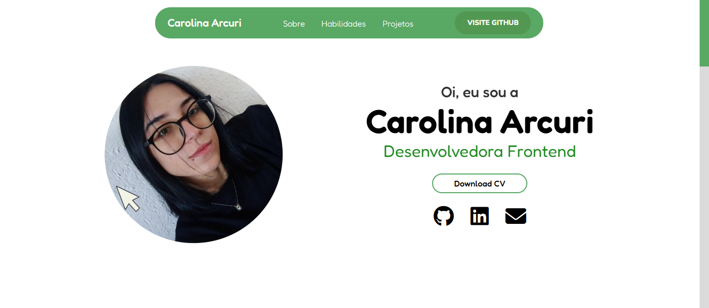
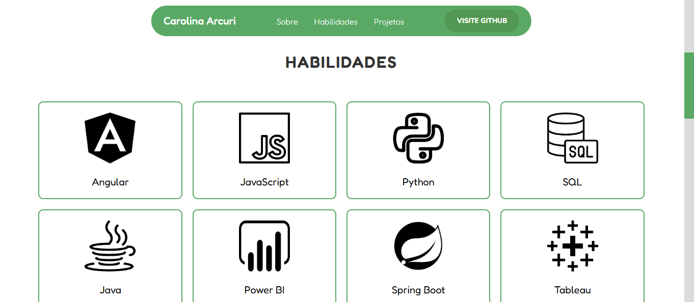
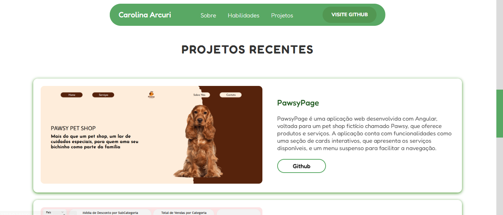
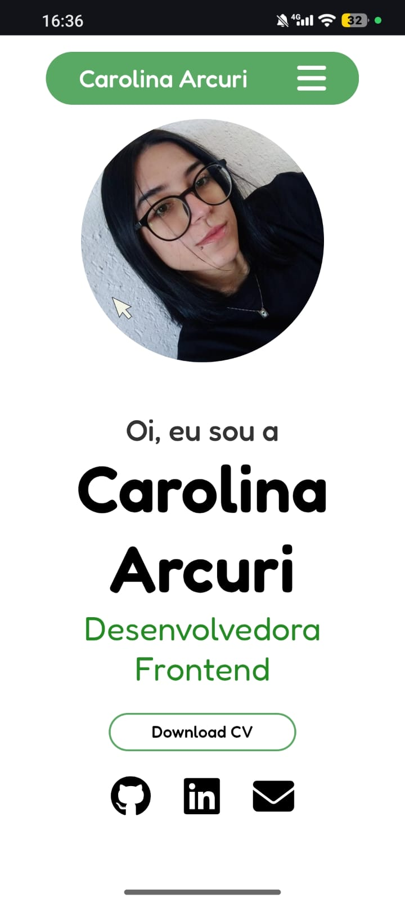
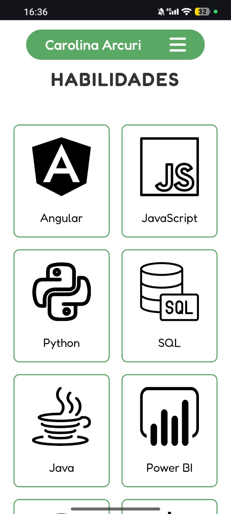

# Meu Projeto Web

Este projeto é um site pessoal/portfólio desenvolvido com HTML, CSS e JavaScript. Ele tem como foco a responsividade e design agradável, com atenção especial a detalhes como esconder barras de rolagem desnecessárias.

## 🚀 Tecnologias

- HTML5
- CSS3
- JavaScript (se aplicável)

## 🎯 Funcionalidades

- Layout responsivo
- Animações suaves
- Design moderno e limpo
- Sem barras de rolagem desnecessárias

  ## Visual

  
